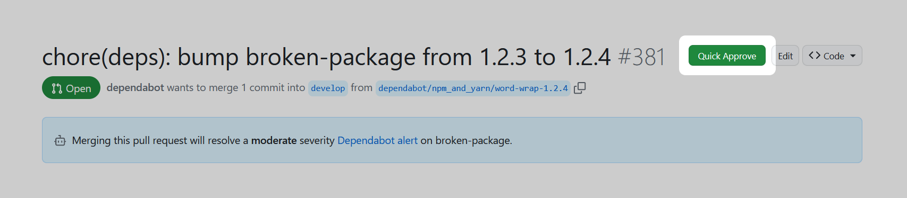

	
	 
	Github Quick Approve

# Github Quick Approve 

An extension that allows you to insert a quick 'Approve' button on your GitHub pull request.

Why might you need this? There are times when you need a fast review of a PR. This could be due to an alert from a bot, or perhaps from a colleague sitting next to you, keen for a review, with a "trust me" face. Accessing GitHub to approve a PR can require several steps, which can be time-consuming. To alleviate this, I developed an extension that simplifies the process needed for approving a PR.

## Installation

- Chrome: TBU
- [Firefox](https://addons.mozilla.org/en-US/firefox/addon/github-quick-approve/)
- UserScript: [Click to install](https://raw.githubusercontent.com/monodyle/github-quick-approve/main/GithubQuickApprove.user.js)

## License

MIT - Monody Le 2023+
